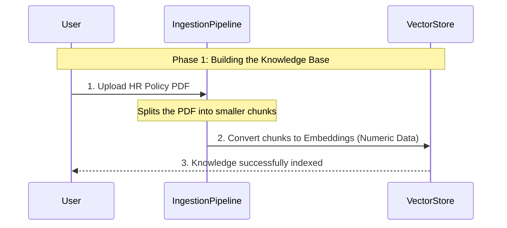
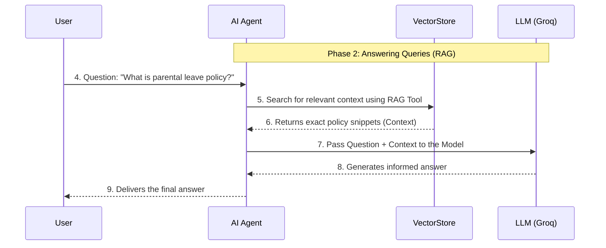

# Chapter 1: AI Chat RAG Workflow

Welcome to the start of building your Enterprise Document Intelligence system! This first chapter introduces the complete blueprint—the "factory layout"—that makes our AI Chat system work.

If you imagine building a complex machine, you need a detailed plan showing how all the parts connect. In our project, this detailed plan is the **AI Chat RAG Workflow**, orchestrated using a tool called n8n.

## 1. Why Do We Need a Workflow?

When we talk about using AI to answer questions based on your private company documents (like HR policies or technical manuals), we need two crucial things to happen:

1.  **Knowledge Injection:** Getting your documents *into* the AI system in a way it can understand and quickly retrieve.
2.  **Smart Conversation:** Making sure the AI uses only that relevant document knowledge to generate an accurate, specific response when a user asks a question.

Our complete workflow defines both processes seamlessly.

### Our Goal Use Case

Let’s focus on a concrete use case:

We want to upload a comprehensive **HR Policy Handbook (PDF)** and then be able to ask the system: *"What is the policy for requesting parental leave?"*

To achieve this, our workflow is divided into two distinct, connected pipelines.

## 2. The Two Phases of the RAG Workflow

Think of our system as having two operational modes running side-by-side:

| Phase | Purpose | Analogy | Key Components (Nodes) |
| :--- | :--- | :--- | :--- |
| **Phase 1: Ingestion Pipeline** | Converts raw documents into usable, searchable numeric data (vectors). This builds the knowledge base. | Stocking the Library Shelves | Loader, [Embeddings Generator (Google Gemini)](04_embeddings_generator__google_gemini__.md), [Vector Knowledge Base (Pinecone)](02_vector_knowledge_base__pinecone__.md) |
| **Phase 2: Conversational RAG Process** | Receives a user query, finds relevant context from the stored knowledge, and generates a final answer using a Large Language Model (LLM). | The Librarian and the Translator | Chat Trigger, [AI Agent Orchestrator](05_ai_agent_orchestrator__.md), [RAG Retrieval Tool](06_rag_retrieval_tool__.md), [Large Language Model (Groq/Llama)](07_large_language_model__groq_llama__.md) |

These two phases define the entire structure of the n8n blueprint file, `AI Chat RAG.json`.

## 3. High-Level Process Walkthrough

Let's visualize how information flows through our system to solve the HR policy use case.

### Phase 1: Ingestion

This phase happens only when new documents are added or updated.



*   **Step 1:** The user uploads the HR Policy PDF via an initial form trigger (`On form submission`).
*   **Step 2:** The document is loaded, cleaned, and processed (`Default Data Loader`).
*   **Step 3:** The text is converted into dense numerical vectors (`Embeddings Google Gemini`) that capture the meaning of the text.
*   **Step 4:** These vectors are stored in our specialized database (`Pinecone Vector Store`)—our ready-to-search knowledge base.

### Phase 2: Retrieval Augmented Generation (RAG)

This phase happens every time a user asks a question in the chat interface.



*   **Step 4:** A user submits a query through the chat trigger (`When chat message received`).
*   **Step 5:** The request goes to the `AI Agent`. This agent's main job is to decide *how* to answer (i.e., should it use a tool, or can it answer directly?). Since the question is about company policy, it uses the **RAG Retrieval Tool**.
*   **Step 6 & 7:** The **RAG Tool** searches the [Vector Knowledge Base (Pinecone)](02_vector_knowledge_base__pinecone__.md) and retrieves the most relevant text snippets.
*   **Step 8:** The `AI Agent` sends *both* the original question *and* the retrieved snippets (the context) to the [Large Language Model (Groq/Llama)](07_large_language_model__groq_llama__.md).
*   **Step 9:** The LLM reads the context and the question, then generates a fluent, accurate answer based *only* on the provided policy information.

## 4. The n8n Workflow Structure

In the `AI Chat RAG.json` file, these two flows are visually separated but logically linked. n8n is a visual workflow automation tool, so you can see these nodes connected by lines.

Here is how the n8n structure reflects Phase 1 (Ingestion):

```json
// AI Chat RAG.json structure snippet (Phase 1)
[
  // 1. Trigger
  {"name": "On form submission", /* ... setup */},
  // 2. Document preparation
  {"name": "Default Data Loader", /* ... reads PDF */},
  // 3. Conversion
  {"name": "Embeddings Google Gemini", /* ... creates vectors */},
  // 4. Storage
  {"name": "Pinecone Vector Store", /* ... saves knowledge */},
  // ...
]
```
The connections ensure that once the PDF is loaded, it flows sequentially through the embedding process and finally into the Pinecone Vector Store. This complete flow defines our [Document Ingestion Pipeline](03_document_ingestion_pipeline_.md).

The subsequent nodes handle Phase 2 (RAG):

```json
// AI Chat RAG.json structure snippet (Phase 2 core)
[
  // 1. Chat Trigger
  {"name": "When chat message received", /* ... setup */},
  // 2. The Decision Maker
  {"name": "AI Agent", /* ... decides tool usage */},
  // 3. The Retrieval Tool (which calls other components internally)
  {"name": "Answer questions with a vector store", /* ... the RAG tool */},
  // 4. The Brain
  {"name": "Groq Chat Model", /* ... generates final text */},
  // ...
]
```
The `AI Agent` node acts as the central hub for the RAG process, directing the user’s query to the correct tool (`Answer questions with a vector store`) to perform the retrieval before generating a response.

## Conclusion

The AI Chat RAG Workflow is the foundational blueprint for our entire system. We learned that it consists of two vital processes: Ingestion (getting knowledge in) and RAG (getting answers out). These processes link specialized components like loaders, embedding generators, and large language models into one powerful system defined in our n8n workflow.

Next, we will dive into the most critical storage location for our system's specialized knowledge: the vector database.

[Vector Knowledge Base (Pinecone)](02_vector_knowledge_base__pinecone__.md)

---
