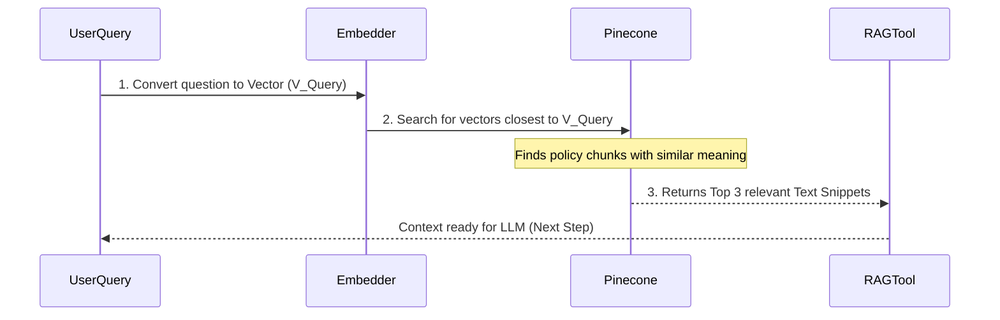

# Chapter 2: Vector Knowledge Base (Pinecone)

Welcome back! In [Chapter 1: AI Chat RAG Workflow](https://github.com/dharanmass/AI-Chat-RAG-System-Enterprise-Document-Intelligence/blob/main/Docs/02_vector_knowledge_base__pinecone__.md), we established the two main phases of our AI system: **Ingestion** (putting knowledge in) and **RAG** (getting answers out).

The component that connects these two phases, serving as the system's long-term memory, is the **Vector Knowledge Base**. We use **Pinecone** as the specific, ultra-fast service for this critical task.

## 1. What is a Vector Knowledge Base? (The Smart Archive)

Imagine your company's entire HR policy handbook is stored in a giant digital library.

If you use a traditional keyword search (like searching a PDF with Ctrl+F) for the phrase "sick days," it will only find those exact words. If the policy uses the phrase "health-related absence," the search fails.

A **Vector Knowledge Base** solves this problem by indexing the documents based on *meaning* or *context*, not just keywords.

### The Role of Pinecone

Pinecone is a highly specialized cloud database designed specifically to store and search these representations of meaning, called **vectors**.

| Component | Analogy | Function |
| :--- | :--- | :--- |
| **Document** | Raw Book/Policy | The original source of information (e.g., the PDF). |
| **Vector** | Specialized Index Card | The numerical representation of the document's *meaning*. |
| **Pinecone** | The Smart Archive | Stores all the index cards for ultra-fast semantic search. |

## 2. The Core Concept: From Words to Numbers

How does the knowledge base achieve semantic search (search by meaning)? Through **vectors**.

### Understanding Vectors

A vector is simply a long list of numbers (like coordinates on a complex map).

*   The process of converting text into these numbers is called **Embedding** (which we will detail in [Chapter 4: Embeddings Generator (Google Gemini)](04_embeddings_generator__google_gemini__.md)).
*   The key concept is that text snippets that are semantically similar (have similar meaning) will have vectors that are numerically "close" to each other in this abstract space.

For example:
*   Text A: "The rule for vacation time."
*   Text B: "Guidelines regarding annual leave."

Although the words are different, their meaning is nearly identical. When converted to vectors, they will be stored very close together in Pinecone.

## 3. How Pinecone Powers Retrieval (Phase 2: RAG)

When a user asks a question, the Vector Knowledge Base (Pinecone) is the first place the AI looks for factual context.

Let's revisit our use case: *"What is the policy for requesting parental leave?"*

Here is the exact retrieval flow involving Pinecone:



1.  **Question is Vectorized:** The question is converted into a vector (V_Query).
2.  **Semantic Search:** Pinecone quickly compares V_Query against the millions of stored vectors from the HR Handbook.
3.  **Retrieval:** Pinecone returns the original text snippets (e.g., the paragraph about parental leave) that correspond to the closest vectors.

This retrieved text is the "context" that is then passed to the Large Language Model to generate the final answer.

## 4. Pinecone in the n8n Workflow

In our project blueprint (`AI Chat RAG.json`), Pinecone is represented by two nodes:

### Node 1: Ingestion Storage (`Pinecone Vector Store`)

This node handles the storage of new documents (Phase 1). It takes the document chunks and the generated embeddings and writes them to the Pinecone index named `n8n-ai`.

```json
// Snippet from AI Chat RAG.json (Ingestion side)
{
  "id": "c2a4a6e0-6f91-4005-9b62-78e177b48f13",
  "name": "Pinecone Vector Store",
  "type": "@n8n/n8n-nodes-langchain.vectorStorePinecone",
  "parameters": {
    "mode": "insert",
    "pineconeIndex": {
      "value": "n8n-ai" // This is the name of your specific index
    }
  }
}
```
**Explanation:** This component ensures that every time a new document is uploaded and vectorized, the resulting numerical knowledge is securely inserted into the `n8n-ai` Pinecone database.

### Node 2: Retrieval Source (`Pinecone Vector Store1`)

This node is accessed internally by the [RAG Retrieval Tool](06_rag_retrieval_tool_.md) during the conversation (Phase 2). It provides the connection needed to perform the search described in Section 3.

```json
// Snippet from AI Chat RAG.json (RAG side connection)
{
  "id": "b23ee0fd-0702-4199-b680-e6431cf57813",
  "name": "Pinecone Vector Store1",
  "type": "@n8n/n8n-nodes-langchain.vectorStorePinecone",
  // Note: This is connected to the 'Answer questions with a vector store' tool
}
```
**Explanation:** The RAG Tool uses this connection to ask Pinecone: "Hey, based on this user question (vector), what are the most relevant document chunks (vectors) you have stored?"

## Conclusion

The Vector Knowledge Base (Pinecone) is the engine of our system's memory. It transforms raw company documents into a searchable numerical format (vectors), allowing the AI to perform extremely fast, contextually aware searches. Without Pinecone, our RAG system would be unable to find the required policy documents based on the *meaning* of a user's question.

Next, we will explore the initial steps of Phase 1, detailing exactly how documents are prepared and sent to Pinecone in the first place.

[Document Ingestion Pipeline](03_document_ingestion_pipeline_.md)

---
