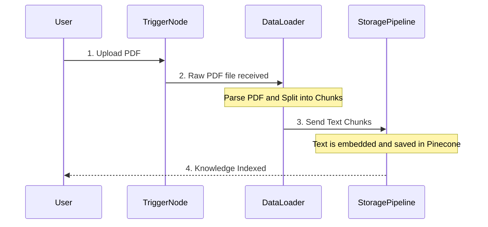

# Chapter 3: Document Ingestion Pipeline

Welcome back! In [Chapter 2: Vector Knowledge Base (Pinecone)](02_vector_knowledge_base__pinecone__.md), we learned that Pinecone serves as our AI system's memory, storing knowledge in the form of numerical vectors.

But how do those vectors—that specialized numerical data—actually get *into* Pinecone?

The answer is the **Document Ingestion Pipeline**. This pipeline is the first step of Phase 1 (Ingestion) and handles everything from receiving a raw PDF file to preparing it for conversion and storage.

## 1. The Role of the Ingestion Pipeline (The Indexing Department)

Imagine your AI system is a giant digital library. Before a librarian can help someone find a specific passage, the books must first be acquired, scanned, summarized, and indexed.

The **Document Ingestion Pipeline** is this dedicated scanning and indexing department. Its job is to take a large, unorganized source document (like an HR Policy PDF) and transform it into many small, clean, standardized pieces of text that the AI can easily process.

**Use Case Goal:** We need this pipeline to reliably take our large **HR Policy Handbook PDF** and prepare it so we can later ask specific questions about parental leave, sick days, etc.

## 2. Components of the Pipeline in n8n

The Ingestion Pipeline is a sequence of three key steps in our n8n workflow (`AI Chat RAG.json`):

| Node (Component) | Function | Analogy |
| :--- | :--- | :--- |
| **On form submission** | The Start Trigger: Receives the uploaded file. | The Receiving Desk |
| **Default Data Loader** | Preparation: Reads the file, extracts text, and breaks it into chunks. | The Scanner and Cutter |
| **Embeddings Generator** | Conversion: Turns text chunks into numerical vectors. | The Translator (Detailed in Chapter 4) |
| **Pinecone Vector Store** | Storage: Saves the vectors in the database. | The Archive Shelf (Detailed in Chapter 2) |

Let's focus on the first two steps, which define the Document Ingestion process.

## 3. Step 1: Receiving the Document (`On form submission`)

The pipeline begins with a trigger node that waits for a user action—uploading a document via a simple web form.

This is the "On form submission" node in our n8n workflow:

```json
// Snippet from AI Chat RAG.json (Trigger)
{
  "name": "On form submission",
  "parameters": {
    "formTitle": "HR Policies",
    "formFields": {
      "values": [
        {
          "fieldLabel": "hrpolicy",
          "fieldType": "file",
          "acceptFileTypes": ".pdf"
        }
      ]
    }
  }
}
```

**What happens here?**
The user sees a form titled "HR Policies." They click "Upload," select the HR Policy PDF from their computer, and submit. The trigger node captures this binary file and passes it directly to the next step.

## 4. Step 2: Preparing the Document (`Default Data Loader`)

This is the most crucial part of ingestion. A raw PDF file is complex; it contains formatting, images, and is often hundreds of pages long. An AI model can't efficiently process one giant file.

The **Default Data Loader** solves this by performing two key tasks:

1.  **Parsing:** It reads the raw PDF file and extracts all the text content.
2.  **Chunking:** It splits that extracted text into smaller, standardized "chunks" (like index cards).

**Why Chunking Matters:** If a user asks a question about parental leave, we don't want the AI to retrieve the *entire 200-page handbook*. We only want the specific paragraph or page that talks about parental leave. Chunking ensures we can retrieve these precise snippets.

Here is the configuration for the loader node:

```json
// Snippet from AI Chat RAG.json (Data Loader)
{
  "name": "Default Data Loader",
  "parameters": {
    "loader": "pdfLoader",
    "binaryDataKey": "hrpolicy"
  }
}
```

**What happens here?**
The loader receives the raw data identified as `hrpolicy` (the PDF file) and uses the internal `pdfLoader` utility to convert that binary file into text documents, automatically splitting the text into chunks ready for embedding.

## 5. The Complete Ingestion Flow

The Document Ingestion Pipeline connects the trigger and the loader to the subsequent conversion and storage nodes, ensuring the knowledge transfer is smooth and automatic.

Here is a simplified visualization of the information flow in Phase 1:



Once the `Default Data Loader` has output the text chunks, those chunks immediately flow to the next node: the [Embeddings Generator (Google Gemini)](04_embeddings_generator__google_gemini__.md).

## Conclusion

The Document Ingestion Pipeline is the indispensable front-end of our RAG system. It is responsible for transforming large, messy documents into clean, manageable text chunks that are ready to be converted into numerical vectors. Without this pipeline, our AI system would have no knowledge base to draw upon.

In the next chapter, we will look in detail at how those text chunks are transformed into the numerical vectors that Pinecone uses for semantic searching.

[Embeddings Generator (Google Gemini)](04_embeddings_generator__google_gemini__.md)

---
