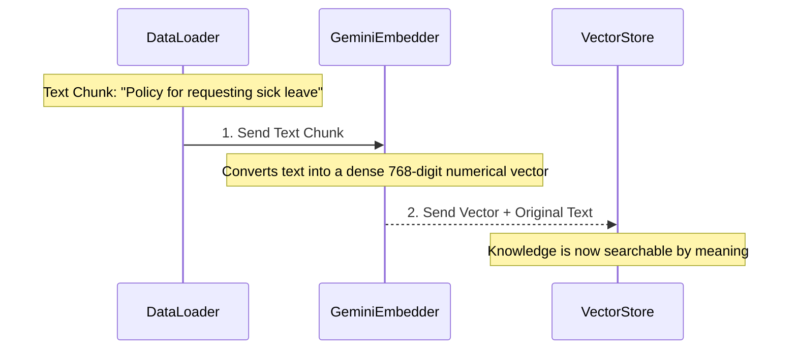
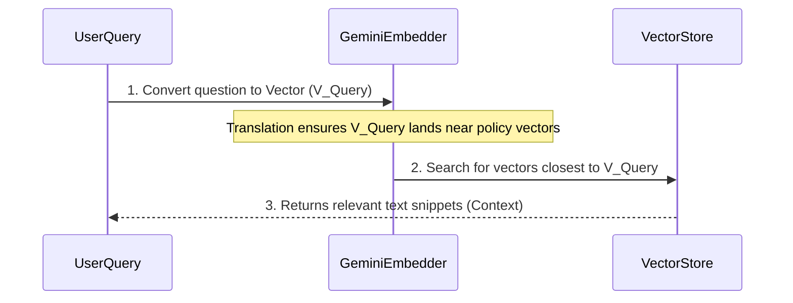

# Chapter 4: Embeddings Generator (Google Gemini)

Welcome back! In [Chapter 3: Document Ingestion Pipeline](03_document_ingestion_pipeline_.md), we successfully took a large HR Policy PDF and sliced it into many manageable text chunks. In [Chapter 2: Vector Knowledge Base (Pinecone)](02_vector_knowledge_base__pinecone__.md), we learned that Pinecone only accepts numerical data (vectors).

This leaves us with a fundamental problem: **How do we convert those human-readable text chunks into the precise mathematical language (vectors) that the computer understands?**

The answer is the **Embeddings Generator**, and in our project, we use a powerful model provided by **Google Gemini** for this essential translation task.

## 1. The Universal Translator

Think of the Embeddings Generator as the system's Universal Translator. It performs the single most critical step that enables "semantic search"—the ability to search by *meaning* rather than just keywords.

### Analogy: Mapping Meaning

Imagine we have two text chunks:

1.  "The maximum allowance for annual vacation is twenty days."
2.  "Employees are permitted to take up to 20 days of yearly paid time off."

To a computer doing a keyword search, these look like completely different sentences.

The Embeddings Generator converts these sentences into long lists of numbers called **vectors**. Because the two sentences have nearly identical meanings, the resulting vectors will be numerically very "close" to each other in the database space.

| Input (Text Chunk) | Output (Vector) | Semantic Result |
| :--- | :--- | :--- |
| "Vacation days" | `[0.12, -0.45, 0.99, ... 768 total numbers]` | Close to "Paid time off" vector |
| "Requesting parental leave" | `[-0.88, 0.23, 0.10, ... 768 total numbers]` | Close to "Maternity policy" vector |

The Google Gemini model is specifically trained to make sure that words and phrases with similar meanings generate vectors that are clustered together.

## 2. Gemini’s Role in the Ingestion Pipeline (Phase 1)

During Phase 1 (Ingestion), the Embeddings Generator sits directly between the document preparation phase and the storage phase.

It receives clean text from the data loader and converts it before it is saved into Pinecone.



This single step allows the thousands of text chunks from your HR Handbook to be indexed by their conceptual meaning, rather than just their raw keywords.

## 3. Gemini’s Role in the RAG Retrieval (Phase 2)

The Embeddings Generator doesn't stop working once the knowledge base is built. It is equally important during Phase 2 (RAG Retrieval), every time a user asks a question.

When you ask the system, *"What is the policy for parental leave?"*, that question must also be translated into a vector.

**Crucially, the exact same Google Gemini embedding model must be used for both ingestion (documents) and query (question).** If you use different translators, their numerical maps won't line up, and the semantic search will fail.

Here is how it works during a user query:



By converting the question into a vector, the system can quickly search the [Vector Knowledge Base (Pinecone)](02_vector_knowledge_base__pinecone__.md) for the closest numerical matches, retrieving only the most contextually relevant paragraphs.

## 4. The Embeddings Generator in n8n

In the n8n workflow blueprint (`AI Chat RAG.json`), the Google Gemini Embeddings Generator appears as a dedicated node, connected to both the Ingestion pipeline and the RAG Retrieval process.

### Configuration

In n8n, the node for the Embeddings Generator is straightforward:

```json
// Snippet from AI Chat RAG.json (Ingestion Side)
{
  "name": "Embeddings Google Gemini",
  "type": "@n8n/n8n-nodes-langchain.embeddingsGoogleGemini",
  "position": [256, 208],
  "credentials": {
    "googlePalmApi": {
      // API Key Setup is managed here
    }
  }
}
```

**Key Takeaways from the n8n Setup:**

1.  **Dual Use:** You will notice this node type appears twice in the full workflow: once connected to the `Pinecone Vector Store` (for ingestion) and once connected to the `Pinecone Vector Store1` (for retrieval during RAG). This ensures the knowledge indexing and the user queries are always compared using the same mathematical standard.
2.  **API Key:** The node requires a Google Gemini API key (set up in the credentials) to access the specialized embedding model that performs the conversion.

Without this component, the text chunks created in Chapter 3 would remain just text, unable to be searched effectively by meaning in the vector database.

## Conclusion

The Embeddings Generator (Google Gemini) is the indispensable **Universal Translator** of our RAG system. It converts human language (text chunks from documents or user questions) into the numerical language (vectors) that enables Pinecone to perform fast, accurate semantic searches. This translation step ensures that when a user asks about "yearly paid time off," the system intelligently retrieves documents discussing "annual vacation."

Now that we understand how knowledge is stored and how user questions are translated, we are ready to explore the system's central decision-maker—the component that decides which tool to use and orchestrates the entire conversational flow.

[AI Agent Orchestrator](05_ai_agent_orchestrator_.md)

---
