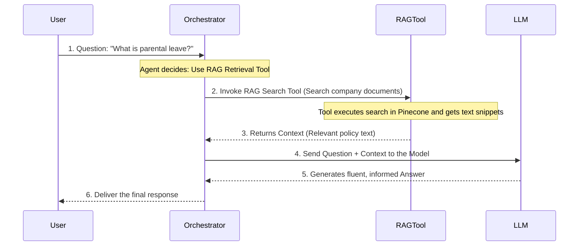

# Chapter 5: AI Agent Orchestrator

Welcome back! So far, we have successfully indexed our company documents, converting them into searchable numerical vectors using the [Document Ingestion Pipeline](03_document_ingestion_pipeline_.md) and the [Embeddings Generator (Google Gemini)](04_embeddings_generator__google_gemini__.md). This knowledge is ready and waiting in our [Vector Knowledge Base (Pinecone)](02_vector_knowledge_base__pinecone__.md).

Now, when a user types a question into the chat, who decides how to answer it?

The answer is the **AI Agent Orchestrator**. This component is the central brain of our RAG system, making sure the right process is executed for every single question.

## 1. The Project Manager of the AI System

Imagine the AI Agent Orchestrator as the **Project Manager** or the **Chief Librarian**.

Its main job is not to provide the answer itself, but to choose the most efficient strategy to find the answer, directing the request to the correct resource.

### Why Do We Need an Orchestrator?

If a user asks our chat system:
1.  **"What is the policy for sick days?"** (Requires company documents.)
2.  **"What is the current date?"** (Requires general knowledge.)
3.  **"Regarding my last question, what if I live overseas?"** (Requires conversational memory.)

Without an Orchestrator, the system would blindly search the HR manual for the current date or try to pull irrelevant facts for a policy question. The Orchestrator prevents this chaos by deciding: *Do I need a specialized tool, or can I use my general knowledge?*

## 2. The Agent's Decision-Making Process

The AI Agent is designed to be smart about using its available **Tools**. In our system, the Agent has access to three primary resources:

| Resource | Purpose | Used For |
| :--- | :--- | :--- |
| **Conversational Memory** | Remembering the context of the current chat session. | Questions that refer back to previous turns (e.g., "Tell me more about *that*."). |
| **RAG Retrieval Tool** | Accessing specialized, indexed company documents (Pinecone). | Factual questions about HR policies, product manuals, or private data. |
| **Large Language Model (LLM)** | General knowledge and response formatting. | Common sense questions, greetings, or summarizing retrieved information. |

When a query arrives, the Orchestrator runs an internal reasoning step to select the right path.

## 3. The Orchestration Workflow

Let's walk through the exact steps the Orchestrator takes when a user asks about company policy. We will use the question: *"What is the policy for requesting parental leave?"*

The Orchestrator immediately recognizes this as a specific, factual query that requires the company's indexed documents, leading it to invoke the **RAG Retrieval Tool**.



### The Crucial Step: Directing the LLM

Notice that the Agent doesn't talk directly to Pinecone or the Embeddings Generator. It uses the specialized **[RAG Retrieval Tool](06_rag_retrieval_tool_.md)** (Step 2).

More importantly, look at Step 4. The Orchestrator packages the **original question** AND the **retrieved context** together before sending it to the [Large Language Model (Groq/Llama)](07_large_language_model__groq_llama__.md).

This is the entire purpose of RAG: The Agent ensures the LLM generates an answer based *only* on the verified company document context, not on its general training data, making the response accurate and reliable.

## 4. The AI Agent in the n8n Workflow

In our project blueprint (`AI Chat RAG.json`), the Orchestrator is represented by the dedicated **AI Agent** node. This node is placed immediately after the chat trigger.

```json
// Snippet from AI Chat RAG.json
{
  "id": "a8f8e808-09af-4827-b48a-84bcba951dbb",
  "name": "AI Agent",
  "type": "@n8n/n8n-nodes-langchain.agent",
  // ... connections configured below
}
```

If you look at the connections in the n8n canvas, you can see how this central node links all the key operational components:

| Connection Type | Connected Node | The Agent Uses This For... |
| :--- | :--- | :--- |
| **`ai_languageModel`** | `Groq Chat Model` | Core reasoning and output generation. |
| **`ai_memory`** | `Simple Memory` | Remembering the conversation history. |
| **`ai_tool`** | `Answer questions with a vector store` | Accessing the company documents via the RAG tool. |

The Orchestrator's configuration tells it, "You have access to this RAG tool, this memory, and this LLM. Now, you decide the best way to handle the user's input."

## Conclusion

The **AI Agent Orchestrator** is the brain and project manager of our conversational system. It ensures efficiency and accuracy by receiving the user's query and intelligently deciding whether to leverage conversational memory, use its general knowledge, or—crucially—invoke the specialized RAG Retrieval Tool to pull specific context from our documents.

This smart decision-making step is what transforms a simple chatbot into a precise Enterprise Document Intelligence system.

Next, we will dive into the specific tool the Agent calls upon for factual, document-based queries: the RAG Retrieval Tool.

[RAG Retrieval Tool](06_rag_retrieval_tool_.md)

---
