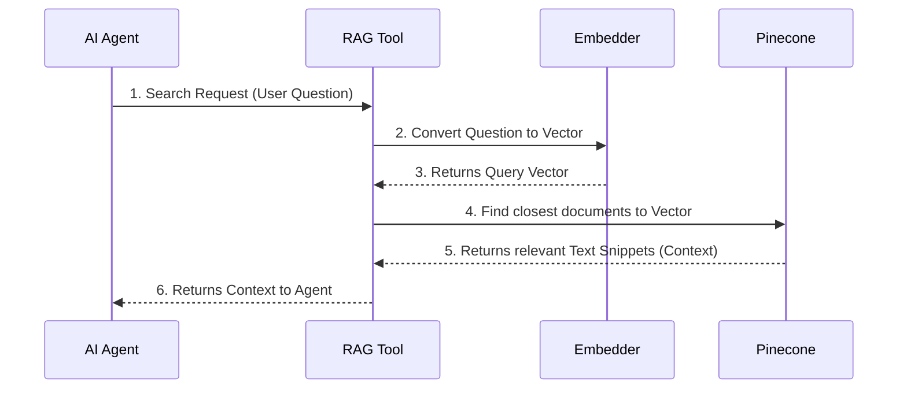

# Chapter 6: RAG Retrieval Tool

Welcome to Chapter 6! In [Chapter 5: AI Agent Orchestrator](05_ai_agent_orchestrator_.md), we established that the AI Agent is the smart decision-maker, directing the conversation flow. When the Agent receives a question that requires specific knowledge—like checking company policies—it knows exactly what to do: **It calls the RAG Retrieval Tool.**

The RAG Retrieval Tool is the highly specialized utility that executes the actual search of your company documents.

## 1. The Specialized Librarian

The RAG Retrieval Tool is essentially the system's specialized librarian, trained only to find specific, factual information from your indexed documents.

### Why does the Agent need a Tool?

The [AI Agent Orchestrator](05_ai_agent_orchestrator_.md) is excellent at deciding *what* needs to be done, but it is not built to perform complex database searches.

Searching the [Vector Knowledge Base (Pinecone)](02_vector_knowledge_base__pinecone__.md) requires multiple steps: translating the query, searching the database, and retrieving the original text chunks. The RAG Retrieval Tool handles this entire sequence of complexity in one callable action.

| Component | Analogy | Role in RAG Process |
| :--- | :--- | :--- |
| **AI Agent Orchestrator** | Chief Librarian | Decides, "We need a policy search." |
| **RAG Retrieval Tool** | Specialized Search Team | Executes the entire search process efficiently. |
| **Vector Knowledge Base** | Archive Shelves | Stores the searchable numerical knowledge. |

## 2. The Retrieval Workflow in Detail

When the [AI Agent Orchestrator](05_ai_agent_orchestrator_.md) decides to use the RAG Retrieval Tool, the following internal workflow happens instantaneously:

Let's use our running example: *"What is the policy for requesting parental leave?"*

1.  **Tool Invocation:** The AI Agent passes the raw user question to the RAG Retrieval Tool.
2.  **Query Translation:** The tool internally calls the [Embeddings Generator (Google Gemini)](04_embeddings_generator__google_gemini__.md) to convert the text query into a vector (a list of numbers representing its meaning).
3.  **Search:** The tool sends this query vector to the [Vector Knowledge Base (Pinecone)](02_vector_knowledge_base__pinecone__.md), requesting the most semantically similar document chunks.
4.  **Context Retrieval:** Pinecone returns the original text chunks (e.g., the exact paragraph about parental leave).
5.  **Context Delivery:** The RAG Tool packages these text snippets and returns them to the AI Agent.

This process ensures that by the time the AI Agent gets the result, it has the exact contextual information needed to answer accurately.

Here is the flow of information controlled by the RAG Retrieval Tool:



## 3. Key Parameter: `topK`

When the RAG Retrieval Tool performs its search in the Vector Knowledge Base, it needs to know how many relevant document chunks to pull out. This is controlled by the **`topK`** parameter.

*   **`K`** stands for the number of retrieved items.
*   If we set `topK = 3`, the tool will retrieve the top 3 most relevant text chunks from the knowledge base.

Setting `topK` is a balance:
*   **Too Low (e.g., K=1):** You might miss important context spread across two paragraphs.
*   **Too High (e.g., K=10):** You slow down the process and force the Large Language Model to read potentially irrelevant information, which can dilute the accuracy of the final answer.

In our project, we usually set `topK` to 3 or 4 to ensure a good balance.

## 4. The RAG Retrieval Tool in n8n

In our n8n blueprint (`AI Chat RAG.json`), the RAG Retrieval Tool is represented by the node named: **`Answer questions with a vector store`**.

### Tool Definition

This node is defined as a specialized tool and connected directly to the [AI Agent Orchestrator](05_ai_agent_orchestrator_.md).

```json
// Snippet defining the RAG Retrieval Tool in AI Chat RAG.json
{
  "name": "Answer questions with a vector store",
  "type": "@n8n/n8n-nodes-langchain.toolVectorStore",
  "parameters": {
    "description": "Use this tool to answer question HR policies",
    "topK": 3 // We instruct the tool to retrieve the top 3 results
  }
}
```

**Key Takeaways from the Definition:**

1.  **Description:** The `description` ("Use this tool to answer question HR policies") is vital. The AI Agent reads this description and uses its internal reasoning to decide, "Since the user is asking about a policy, I must use the tool described for HR policies."
2.  **Internal Connections:** The `Answer questions with a vector store` node manages the internal links to `Pinecone Vector Store1` and the corresponding `Embeddings Google Gemini1` node, ensuring the retrieval process works seamlessly without requiring the Agent to manage these sub-components.

Once the RAG Retrieval Tool finishes its job (Step 6 in the diagram above), it passes the retrieved policy text directly back to the AI Agent. The Agent then bundles this context with the original question and prepares the final message for the next component.

## Conclusion

The **RAG Retrieval Tool** is the indispensable specialist in our system. It is the callable utility responsible for executing the core RAG retrieval process: translating the user's query, searching the [Vector Knowledge Base (Pinecone)](02_vector_knowledge_base__pinecone__.md), and delivering the most relevant text snippets (the context) back to the [AI Agent Orchestrator](05_ai_agent_orchestrator_.md). By automating this complex search, the tool ensures the system finds accurate, document-specific information quickly.

Now that the AI Agent has the user's question and the supporting document context, the only job left is to generate a fluent, human-readable answer. This is where the final component comes in: the Large Language Model.

[Large Language Model (Groq/Llama)](07_large_language_model__groq_llama__.md)

---
