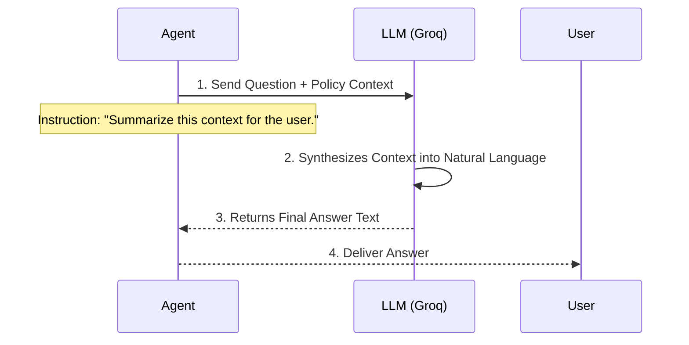

# Chapter 7: Large Language Model (Groq/Llama)

Welcome to the final core piece of our Retrieval Augmented Generation (RAG) system! We have successfully built the memory and the intelligence network, but we still need a fluent communicator.

In [Chapter 6: RAG Retrieval Tool](06_rag_retrieval_tool_.md), the specialized tool completed its mission: it retrieved the exact policy text about parental leave and handed it back to the [AI Agent Orchestrator](05_ai_agent_orchestrator_.md).

The job is now complete, except for one thing: **That retrieved text is just a raw paragraph from a policy document.** It needs to be polished into a friendly, coherent, human-like answer.

This is the job of the **Large Language Model (LLM)**. In our project, we use the high-performance **Llama 3 model** hosted by **Groq** to act as the final conversational writer.

## 1. What is the Large Language Model (LLM)? (The Conversational Writer)

The Large Language Model is the most recognizable part of modern AI. It is the skilled conversationalist, the writer, and the summarizer.

In the context of our RAG system, the LLM is *not* used for searching documents or making high-level decisions. Its primary job is synthesis: **taking all the gathered information and writing the final, perfectly worded response.**

### Our Use Case: Generating the Final Answer

Let’s look at the crucial input the LLM receives from the [AI Agent Orchestrator](05_ai_agent_orchestrator_.md):

| Input Component | Example Content | Source |
| :--- | :--- | :--- |
| **User Question** | "What is the policy for requesting parental leave?" | User Input |
| **Retrieved Context** | "Employees must submit form HR-45B 60 days in advance. Paid leave is capped at 12 weeks for the primary caregiver and 2 weeks for the secondary caregiver." | RAG Retrieval Tool (from Pinecone) |
| **Instruction** | "Based ONLY on the context provided, answer the user's question naturally." | AI Agent Orchestrator |

The LLM reads these three inputs and then generates the final output:

> "The policy for parental leave requires primary caregivers to submit form HR-45B at least 60 days in advance. The paid leave limit is 12 weeks for the primary caregiver, and 2 weeks for the secondary caregiver."

This is the power of the LLM: transforming raw, technical facts into a smooth, helpful explanation.

## 2. Groq and Llama 3: Speed and Intelligence

While there are many Large Language Models (like OpenAI’s GPT or Google’s Gemini), our project specifically utilizes Llama 3 running on the **Groq** platform.

### A Note on Groq

Groq is a technology company that provides exceptionally fast inference (response generation) for LLMs.

Think of it this way: Llama 3 is the powerful engine (the brain), and Groq is the super-fast road and fueling system (the technology platform) that allows the engine to deliver answers almost instantly.

The speed is crucial for a chat interface, ensuring the user doesn't wait long for the policy answer.

## 3. The LLM’s Role in the RAG Workflow (Phase 2)

The LLM is the last step in the conversational RAG workflow. It is called only after the context has been successfully retrieved.

Here is the simplified RAG process, focusing on the final step involving the LLM:



If the RAG Retrieval Tool had not found any relevant context, the LLM would simply respond based on the Agent's instructions, perhaps saying: *"I am sorry, but I could not find information on that policy in the documents provided."* This adherence to the retrieved context is what makes the RAG system trustworthy.

## 4. The LLM in the n8n Workflow

In our n8n blueprint (`AI Chat RAG.json`), the Groq/Llama model appears as a dedicated node connected to the [AI Agent Orchestrator](05_ai_agent_orchestrator_.md).

### Node 1: The Agent’s Core Brain (`Groq Chat Model`)

This connection gives the Agent its core ability to reason, choose tools, and generate the final output.

```json
// Snippet defining the Groq LLM connected to the Agent
{
  "id": "ec9ab8dd-704f-4e9a-a122-bf12bdcc2703",
  "name": "Groq Chat Model",
  "type": "@n8n/n8n-nodes-langchain.lmChatGroq",
  "parameters": {
    "model": "llama-3.3-70b-versatile"
  }
}
```

**Key Configuration Details:**

1.  **Node Type:** The `lmChatGroq` type indicates we are using a chat model hosted by Groq.
2.  **Model Selection:** We specify which specific model to use, in this case, a high-performing Llama 3 version (`llama-3.3-70b-versatile`).

### Node 2: The RAG Tool’s Internal LLM (`Groq Chat Model1`)

You may notice a second, identical Groq node (`Groq Chat Model1`) connected to the [RAG Retrieval Tool](06_rag_retrieval_tool_.md).

```json
// Snippet defining the Groq LLM connected to the RAG Tool
{
  "id": "c9ce47cc-f030-437e-bafa-4ea632b9cdec",
  "name": "Groq Chat Model1",
  "type": "@n8n/n8n-nodes-langchain.lmChatGroq",
  // ... parameters match the main Groq node
}
```

**Why two LLM nodes?**

Sometimes, complex tools (like our RAG Tool) require a language model *internally* to help structure or interpret the search results *before* sending them back to the main Agent. Using a dedicated LLM instance ensures the RAG Tool can operate independently and efficiently structure the raw context it retrieved from Pinecone. Both models, however, are powered by Groq and Llama 3.

## Conclusion

The **Large Language Model (Groq/Llama)** is the indispensable voice of our Enterprise Document Intelligence system. It takes the factual context retrieved by the RAG tool and synthesizes it into a fluent, accurate, and human-friendly response. By using a fast LLM platform like Groq, we ensure that the entire complex RAG process—from query translation to database search and final response generation—occurs almost instantly, providing an excellent user experience.

This chapter concludes the walkthrough of all the core components needed to run our AI Chat RAG System!

---
