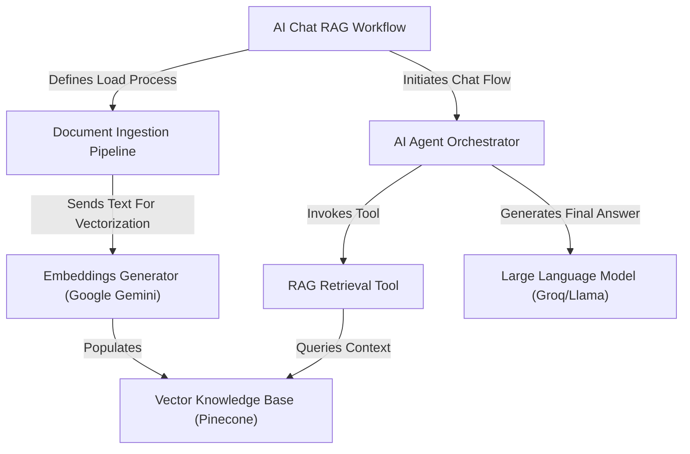

# AI-Chat-RAG-System-Enterprise-Document-Intelligence

This project is an automated **AI Chat RAG System** built on n8n designed for enterprise document intelligence. Its primary function is to transform HR policy *PDF documents* into a searchable *Vector Knowledge Base* where information is stored by meaning. When a user asks a question, an *AI Agent Orchestrator* efficiently retrieves precise context using the RAG technique and delegates the final generation of a reliable, human-like response to a **Large Language Model** (Groq/Llama).

## Visual Overview

## Chapters

1. [AI Chat RAG Workflow
](01_ai_chat_rag_workflow_.md)
2. [Vector Knowledge Base (Pinecone)
](02_vector_knowledge_base__pinecone__.md)
3. [Document Ingestion Pipeline
](03_document_ingestion_pipeline_.md)
4. [Embeddings Generator (Google Gemini)
](04_embeddings_generator__google_gemini__.md)
5. [AI Agent Orchestrator
](05_ai_agent_orchestrator_.md)
6. [RAG Retrieval Tool
](06_rag_retrieval_tool_.md)
7. [Large Language Model (Groq/Llama)
](07_large_language_model__groq_llama__.md)

---
